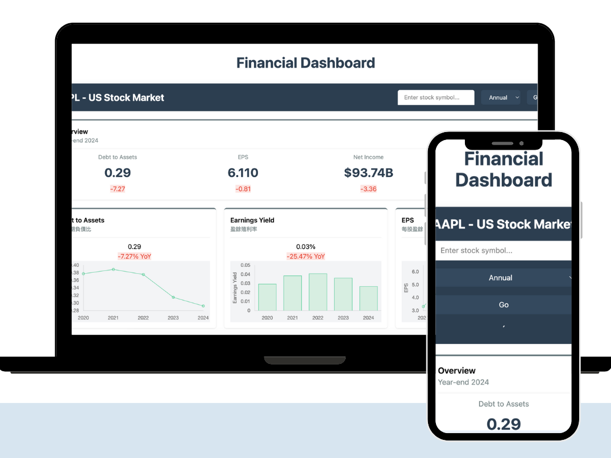

# Finance Dashboard

A modern financial dashboard built with React, Vite, and Chart.js that visualizes market data.



## Features

- Financial data visualization
- Interactive charts using Chart.js and react-chartjs-2
- Responsive design with Tailwind CSS
- Market data analysis

## Prerequisites
- A serverless worker or a backend to provide input data that meets the format as the `staticData` in `/data/static.js`

## Getting Started

### Prerequisites

- Node.js (v18 or later recommended)
- npm or yarn

### Installation

1. Clone the repository
```bash
git clone https://github.com/yourusername/finance-dash.git
cd finance-dash
```

2. Install dependencies
```bash
npm install
```

3. Set up environment variables
Create a `.env.local` file with required API keys and settings


### Development

Run the development server:
```bash
npm run dev
```

For development with API mode:
```bash
npm run dev:api
```

### Building for Production

```bash
npm run build
npm run preview
```

## Technologies Used

- React 19
- Vite 6
- Chart.js & react-chartjs-2
- Tailwind CSS
- SWR for data fetching

## License

This project is licensed under the terms found in the LICENSE file.
